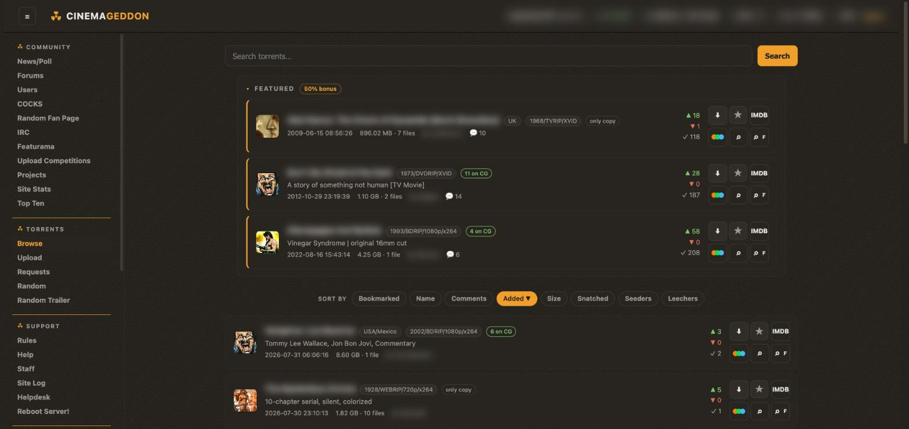
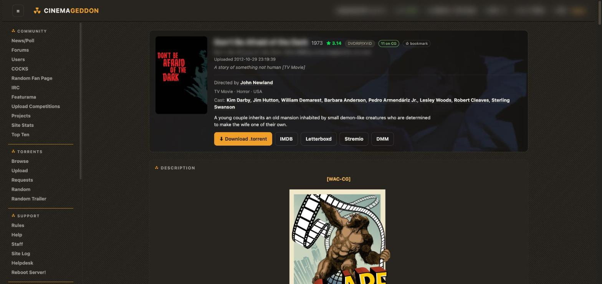

# Cinemageddon Redux

A modern, dark frontend for [cinemageddon.net](https://cinemageddon.net), delivered as a single
Tampermonkey userscript. It parses the legacy 2004-era server HTML on the fly and re-renders
each page client-side — no server access, no API, nothing to install beyond the script.





## Features

- Two colour schemes — **Warm** (brown dark) and **Cold** (neutral graphite) — switchable from the top bar
- Settings window (gear in the top bar, or the Tampermonkey menu) to toggle the
  Letterboxd/Stremio/DMM buttons, the imgur relay, and IMDB titles on browse cards
- Sticky top bar (ratio, buffer, credits, PMs) and a scrollable sidebar that keeps the current page in view
- Browse as rich cards: covers, tags, seeder/leecher/snatch counts, featured shelf, sort chips
- Torrent details hero card with poster zoom, director/cast (fetched from IMDB), one-click **IMDB / Letterboxd / Stremio / DMM** buttons, and an inline comment box
- Forums, PMs, and comments restyled with proper post cards, quote/edit buttons, and BBCode rendering (including working `[hide]` spoilers)
- Every post box gets the same editor: BBCode toolbar, smilie picker, this site's own BBCodes (read live from `tags.php`), and an expandable live preview
- Collapsible panels remember whether you left them open
- Modernised forms: upload, profile edit, signup, PM compose, request pages
- User profiles as info-tile cards with country flag, action buttons, collapsible cigar shelves, and full-width BBCode Info section
- Friends/blocks as user cards, top-ten medals, site stats with clean bar charts, COCKS pages, helpdesk, site log, and ~45 routes in total
- imgur images un-blocked for UK ISPs via the [imgup.uk](https://imgup.uk) relay
- External links open in new tabs; poster/screenshot images get a click-to-zoom modal
- Fails safe: if a page's markup can't be parsed (or isn't covered), the original legacy page is shown untouched

## Installation

1. Install [Tampermonkey](https://www.tampermonkey.net/) for your browser.
2. **Chrome / Edge only:** userscripts require the browser's developer mode —
   go to `chrome://extensions`, and toggle **Developer mode** on (top right).
   Tampermonkey shows a banner walking you through this if it's off.
3. Click to install the script:

   **[Install Cinemageddon Redux](https://raw.githubusercontent.com/maxh0p/cinemageddon-redux/main/cg-redux.user.js)**

   Tampermonkey will open its install screen — confirm, then reload cinemageddon.net.

Updates are picked up automatically through Tampermonkey's update checks
(`@updateURL` points at this repository).

### Recommended Tampermonkey settings

- **Early injection** — modern (MV3) Tampermonkey injects scripts late by default,
  which can let the legacy UI flash before the script's dark cloak lands. Fix:
  Tampermonkey Dashboard → Settings → set *Config mode* to **Advanced** →
  section *Security* → set **Content Script API** to **UserScripts API Dynamic**.
  (This replaces the old MV2-era "Inject Mode: Instant" setting.)

No other settings are needed — the script's cross-origin requests (IMDB cast/crew,
Letterboxd links) are declared via `@connect` and work out of the box.

### Recommended Stylus addition

For a completely flash-free experience (covers the rare frame before Tampermonkey
injects, e.g. on cold browser starts), add the companion cloak style:

1. Install [Stylus](https://add0n.com/stylus.html).
2. Click to install the style:

   **[Install pre-render cloak](https://raw.githubusercontent.com/maxh0p/cinemageddon-redux/main/extras/cg-redux-cloak.user.css)**

   Stylus recognises the UserCSS format and opens its install screen.

3. In Stylus' own settings, enable the *Advanced* option
   **Instant injection via synchronous XHR** so the cloak applies before first paint.

The style hides the page until the userscript signals it has rendered
(a `data-cgx-ready` attribute on `<html>`), and **fails open**: if the userscript
never runs — Tampermonkey disabled, script updating, whatever — the page reveals
itself after 3 seconds. Safe to leave enabled permanently.

The cloak's canvas colour is fixed to the Warm scheme's background — a static
style can't read the userscript's stored choice — but both schemes are dark, so
the difference is imperceptible.

## Page coverage

Reworked: home/news, browse, torrent details, upload, requests, credits, featurama,
upload competitions, random trailer, top ten, site stats, ranks, invites, IRC/chat,
forums (boards, threads, search, compose/edit/quote), messages (inbox, sentbox, view, compose),
users, user details, friends & blocks, bookmarks, reseeds, snatches, cigars, tags, smilies, polls,
staff, site log, helpdesk, help articles, rules, donate, login, signup, profile edit,
and the COCKS pages (index, articles, listings, subscriptions, endoscope search).

Anything not covered renders as the untouched legacy site, and any parser failure on a
covered page falls back to the legacy page rather than a broken one.

## To do

- [ ] Get listed on Greasy Fork — or package as a dedicated browser extension

## Privacy / external requests

- Cast, director, and rating info comes from IMDB's public suggestion API; Letterboxd
  links are resolved against letterboxd.com. Both are declared with `@connect`.
- `i.imgur.com` images are rewritten to the `imgup.uk` relay (imgur is blocked by
  several UK ISPs). The relay states a limit of ~30 requests/hour/IP.
  Can be turned off in the settings window if your ISP doesn't block imgur.
- Nothing else leaves your browser; there is no analytics or telemetry of any kind.

## Development

Work against a local checkout with a dev-loader stub so edits apply on plain page reload:

```js
// ==UserScript==
// @name         Cinemageddon Redux (dev loader)
// @namespace    cg-redux
// @version      1.0
// @match        https://cinemageddon.net/*
// @run-at       document-start
// @require      file:///path/to/your/checkout/cg-redux.user.js
// @grant        GM_xmlhttpRequest
// @grant        GM_registerMenuCommand
// @connect      v3.sg.media-imdb.com
// @connect      letterboxd.com
// ==/UserScript==
```

One-time setup:

1. `chrome://extensions` → Tampermonkey → Details → **Allow access to file URLs** on.
2. Tampermonkey Dashboard → Settings → *Config mode*: **Advanced** →
   section *Externals* → **Update interval: Always**.

With that, Tampermonkey re-reads the `@require`'d file from disk on every page load.
Disable the real script while the dev loader is active, and keep the stub's
`@grant`/`@connect` lines a superset of the main script's — its code runs under the
stub's grants.

Syntax check before reloading: `node --check cg-redux.user.js`.

## Support

If this script makes your CG browsing nicer and you fancy saying thanks,
you can [buy me a coffee on Ko-fi](https://ko-fi.com/maxh0p). ☕

## License

[MIT](LICENSE)
